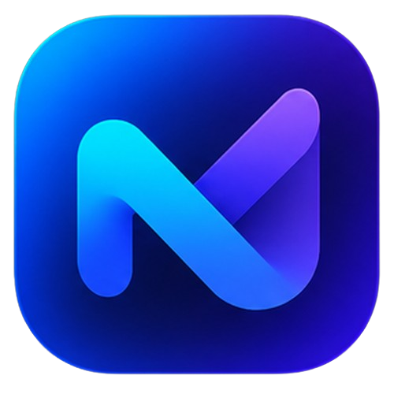

## 🌐 Demo

🚀 **Nexora Online:**  
https://nexora-3gl1.onrender.com/

# 🚀 Nexora

<p align="center">
  
</p>

<h1 align="center">Nexora</h1>

<p align="center">
  Sistema Full Stack de gerenciamento de tarefas
</p>

<p align="center">
  <strong>Organize. Priorize. Conclua.</strong>
</p>

<p align="center">
  Node.js • Express • PostgreSQL • JavaScript • JWT • Chart.js
</p>

---

## 📌 Sobre o projeto

O **Nexora** é um sistema Full Stack de gerenciamento de tarefas desenvolvido para demonstrar, na prática, conhecimentos de desenvolvimento web, criação de APIs, autenticação, banco de dados e construção de interfaces modernas.

O sistema permite que usuários criem suas próprias contas e gerenciem suas tarefas através de um dashboard completo.

Cada usuário possui seus próprios dados e tarefas, protegidos por autenticação utilizando **JWT**.

O projeto foi desenvolvido com foco em:

- Desenvolvimento Full Stack
- API REST
- Autenticação
- Banco de dados relacional
- CRUD
- Segurança básica
- Interface responsiva
- Experiência do usuário
- Organização de código
- Deploy em ambiente de produção

---

# 🎯 Objetivo

O objetivo principal do Nexora é demonstrar a construção de uma aplicação completa, conectando:

```text
Frontend
   ↓
JavaScript
   ↓
API REST
   ↓
Node.js + Express
   ↓
PostgreSQL
